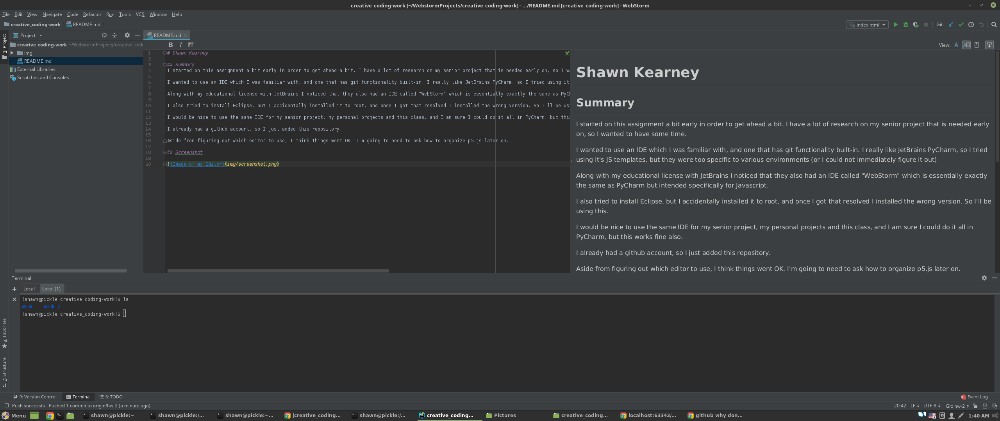

# Shawn Kearney

## Summary

I wanted to use an IDE which I was familiar with, I really like JetBrains PyCharm, so I decided on WebStorm.

I also tried to install Eclipse, but I accidentally installed it to root, and once I got that resolved I installed the wrong version.

It would be nice to use the same IDE for my senior project, my personal projects and this class, and I am sure I could do it all in PyCharm, but this works fine also.

I already had a github account, so I just added this repository. I was not totally familiar yet with how to use it, so getting some practice will be helpful. Markdown seems a lot more straightforward than HTML.

Aside from figuring out which editor to use, I think things went OK. I'm going to need to ask how to organize p5.js later on.

I did not ask for, nor helped with other students' assignments.

## Steps Taken
* Downloaded the p5 library
* Found and installed Webstorm
    * Familiarized myself with how webstorm differs from PyCharm
    * Ran a simple test
* Write this file
* Looked at other students's examples
    * Realized I did everything completely wrong
* Rewrote this file
* I hope I included everything I needed to.

## p5 TypeScript Definitions

Here is a [script](https://github.com/p5-types/p5.ts) for generating a typescript definition for auto-completion and code suggestions. 

I did not run the script; somewhere inside that repository is a pre-built one. I do not know if it is up to date or not.

## Screenshot

