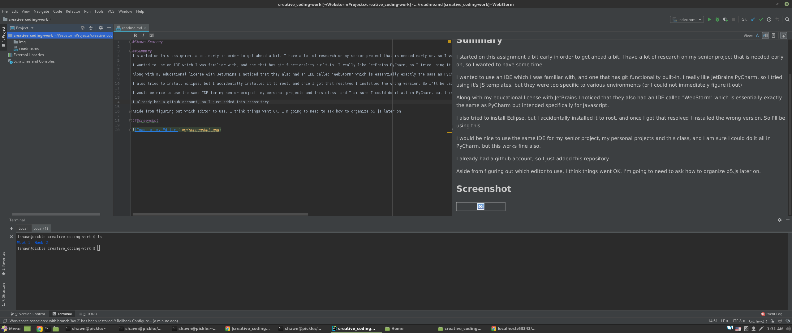

# Shawn Kearney

## Summary
I started on this assignment a bit early in order to get ahead a bit. I have a lot of research on my senior project that is needed early on, so I wanted to have some time.

I wanted to use an IDE which I was familiar with, and one that has git functionality built-in. I really like JetBrains PyCharm, so I tried using it's JS templates, but they were too specific to various environments (or I could not immediately figure it out)

Along with my educational license with JetBrains I noticed that they also had an IDE called "WebStorm" which is essentially exactly the same as PyCharm but intended specifically for Javascript.

I also tried to install Eclipse, but I accidentally installed it to root, and once I got that resolved I installed the wrong version. So I'll be using this.

I would be nice to use the same IDE for my senior project, my personal projects and this class, and I am sure I could do it all in PyCharm, but this works fine also.

I already had a github account, so I just added this repository.

Aside from figuring out which editor to use, I think things went OK. I'm going to need to ask how to organize p5.js later on.

## Screenshot

